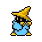

<!-- HEADER -->

  

<!-- GIF -->

  

  Sistemas • Dados • Robótica • Pesquisa

---

## Sobre

Desenvolvedor em formação com foco na construção de sistemas complexos e exploração de dados.  
Interesse em transformar ideias em sistemas funcionais — de algoritmos a aplicações reais.

---

## Caminho Atual

  
  
  
  

---

## Projetos

- Sistema de reconhecimento de objetos com câmera  
- Processamento distribuído com Hadoop e Spark (RDD)  
- Análise de grafos aplicada a comunicação por e-mail  
- Sistemas embarcados e monitoramento com sensores  

---

## Ferramentas

  
  
  
  
  

---

## Pesquisa

Atualmente trabalhando com análise de dados em fluxo contínuo utilizando MOA.  
Foco em seleção de instâncias e eficiência em ambientes dinâmicos.

---

## Estatísticas

  

---

## Atividade

---

<!-- FOOTER -->

  

